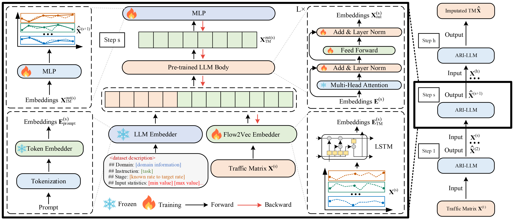
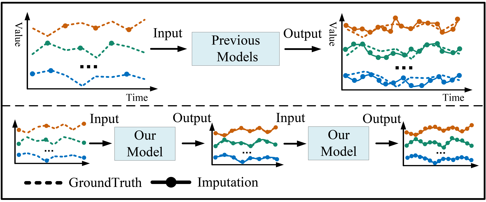
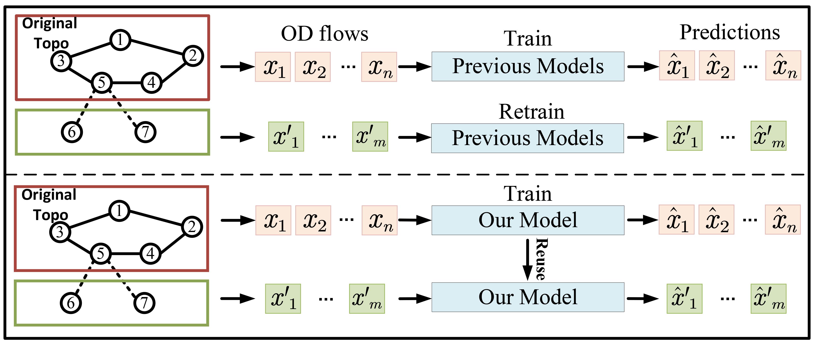

<div align="center">
  <!-- <h1><b> TM-LLM </b></h1> -->
  <!-- <h2><b> TM-LLM </b></h2> -->
  <h1><b> (INFOCOM 2026) ARI-LLM: Autoregressive Imputation for Network Traffic Matrix via Large Language Models</b></h1>
</div>

## Abstract

> Only the chairs can edit The Traffic Matrix (TM) plays a vital role in a wide range of network management tasks, yet monitoring complete TMs is prohibitively expensive. Recent efforts focus on recovering incomplete TMs via learning-based models by learning from historical TM snapshots. However, existing approaches often suffer from poor generalization and require frequent retraining when the network environment evolves-let alone unseen networks. In this paper, we propose a novel TM imputation framework, named ARI-LLM, based on Large Language Models (LLMs). Inspired by human-like cognitive process of coarse-to-fine reasoning, our method incrementally refines the incomplete TM through a step-wise autoregressive mechanism, which is compatible with the pretraining paradigm of LLMs, endowing our model with powerful generalization and zero-shot capabilities. To ensure plug-and-play deployment across TM imputation tasks in dynamic environments, we craft a flow-aware tokenization scheme that supports scalable and topology-adaptive embeddings. Extensive experiments demonstrate that ARI-LLM significantly outperforms state-of-the-art methods on large-scale sparse TMs (over 90% missingness), reducing imputation error by up to 34.7%. It maintains strong performance whether given only limited TM knowledge (e.g., 20% observed flows, 5% training snapshots) or no prior knowledge at all on unseen networks.

## Introduction
ARI-LLM adopts an autoregressive imputation strategy, where the output of each stage is predicted based on the input from the previous stage. This process continues until the entire traffic matrix is completed, enabling imputation for an arbitrary number of OD pairs.



* Previous models apply one-step imputation to recover the entire TM in a single pass, whereas our autoregressive model iteratively predict a finer TM based on a coarser one.



* Previous models require retraining once new flows are involved, whereas our model adapts to new flows without retraining.




## Requirements
Use python 3.10 from MiniConda

- absl-py==1.2.0
- einops==0.4.1
- h5py==3.7.0
- keopscore==2.1
- opt-einsum==3.3.0
- pytorch-wavelet
- PyWavelets==1.4.1
- scikit-image==0.19.3
- scikit-learn==1.0.2
- scipy==1.7.3
- statsmodels==0.13.2
- sympy==1.11.1
- transformers==4.46.0

To install all dependencies:
```
pip install -r requirements.txt
```

## Datasets
- Abilene dataset
- GÉANT dataset
- WS-DREAM dataset

These three public datasets are under `./dataset/net_traffic/Abilene`, `./dataset/net_traffic/GEANT` and `./dataset/net_traffic/wsdream`. Once the paper is accepted, we will make the dataset download link publicly available.


## LLM settings
`./Imputation/models/ARI-LLM.py` provides examples of using GPT2, deepseek_R1_1.5b, and llama_3.1_8b. Our experiments are based on these models. Please download the corresponding models from Hugging Face to the corresponding locations.

## How to Run the Model
We provide four experiment scripts for demonstration purpose under the folder `./ARI-LLM/Imputation` and `./ARI-LLM/Imputation/scripts`.
### Option 1: Using the .py Script

Abilene Dataset Test:
```bash
python ./Imputation/run_abilene.py
```
GÉANT Dataset Test:
```bash
python ./Imputation/run_geant.py
```
WS-DREAM Dataset Test:
```bash
python ./Imputation/run_wsdream.py
```

### Option 2: Using the .sh Script

Abilene Dataset Test:
```bash
bash ./Imputation/scripts/Abilene.sh
```
GÉANT Dataset Test:
```bash
bash ./Imputation/scripts/GEANT.sh
```
WS-DREAM Dataset Test:
```bash
bash ./Imputation/scripts/wsdream.sh
```

## Detailed usage

Please refer to ```./Imputation/run.py``` for the detailed description of each hyperparameter.


